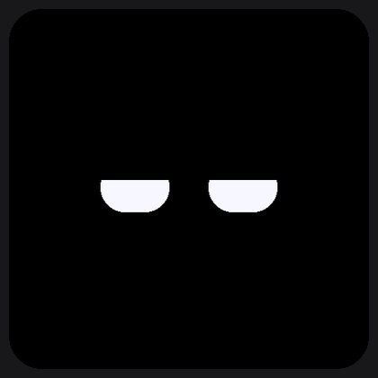
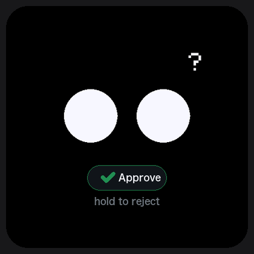
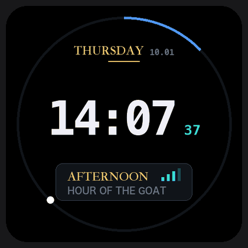
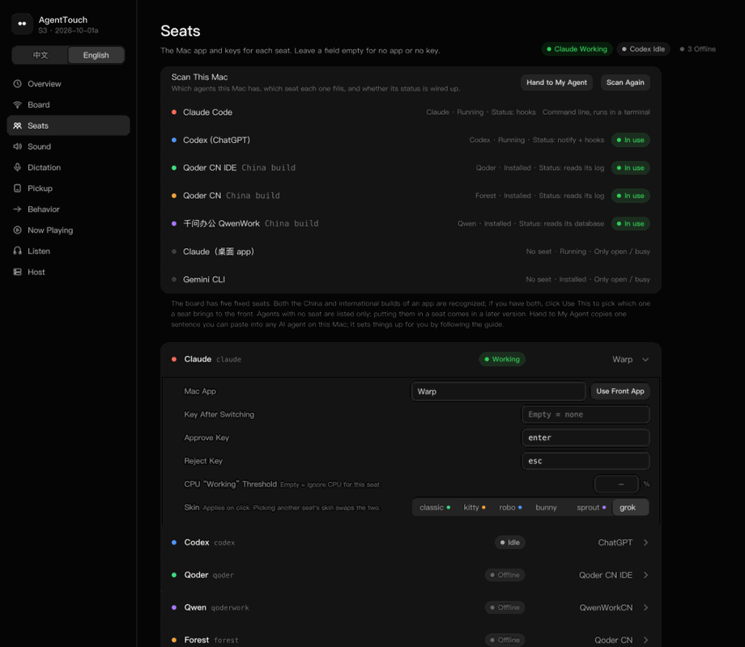
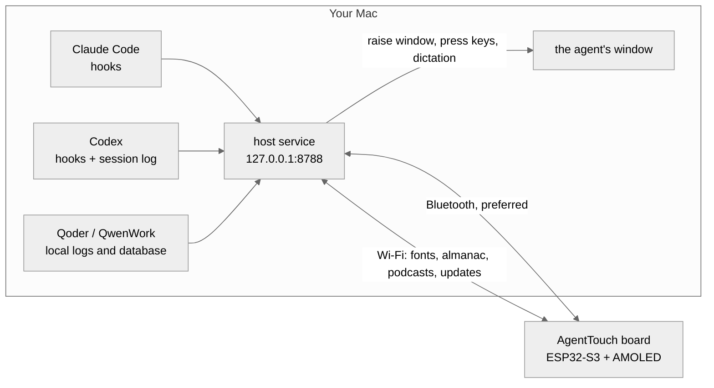

<p align="center">
  
</p>

<h1 align="center">AgentTouch</h1>

<p align="center">
  <b>A small face on your desk for your AI coding agents.</b><br>
  It shows what Claude Code, Codex, Qoder and QwenWork are doing, approves with a tap, and takes dictation.
</p>

<p align="center">
  English · <a href="README.zh-CN.md">简体中文</a>
</p>

<p align="center">
  <a href="LICENSE"></a>
  
  
</p>

<p align="center">
  
  
  
</p>
<p align="center"><sub>Idle → working → needs you → done &nbsp;·&nbsp; Tap to approve &nbsp;·&nbsp; The grok skin</sub></p>

https://github.com/user-attachments/assets/155b532f-d46f-4f69-8415-f9d9466a5a21

<p align="center"><sub>A 60-second tour (Chinese captions). What's on the screen is drawn by the firmware's own code; the product shots, the transitions and the touch markers are illustrative.</sub></p>

## Features

- **See what your agent is doing.** Idle, working, needs you, done: each has its own face. The board has five seats (Claude Code, Codex, Qoder IDE, QwenWork, Qoder desktop). Swipe to switch, and the Mac brings that agent to the front.
- **Tap to approve.** When an agent asks for permission, the board jumps to its face with an Approve bubble. Tap to approve, hold to reject; the Mac presses the key for you.
- **Several Claude Code windows.** With two or more open, a row on top of the face names the session it means; tap its halves to step through them. Approving and dictation go to that session's own terminal tab.
- **Talk to it.** Hold the right key and speak. Your words land in the agent's input box; tap the screen to send.
- **Six skins, one per seat.** classic, kitty, robo, bunny, sprout and grok, so switching agents switches characters.
- **Turn it on its side.** A ring clock, what your Mac is playing, an on-board podcast player, a calendar and a Chinese almanac. Lay it face down and it sleeps.
- **A bit of a pet.** Stroke it, shake it, plug it in to feed it. After 90 minutes of non-stop work it tells you to take a break.

<p align="center">
  
  
</p>

<p align="center">
  
  
  
</p>
<p align="center"><sub>Plug in: it eats &nbsp;·&nbsp; Fully charged: a burp &nbsp;·&nbsp; 90 minutes of work: break time</sub></p>

## Settings on your Mac

There are no settings on the board. Everything lives in a local web page at <http://127.0.0.1:8788/settings> (English and Chinese) and applies on click: seats and skins, the board's Wi-Fi, sound, dictation, now playing, podcasts and the host's health.

<p align="center">
  
</p>
<p align="center"><sub>The Mac name, Wi-Fi names, IP and song title in the screenshots are placeholders.</sub></p>

## How it works



- **Everything stays on your Mac.** The agents report through their own hooks or local files; no code or conversation is uploaded anywhere.
- **The board is a pure client.** Bluetooth alone is enough; Wi-Fi adds fonts, podcasts, speech and cable-free updates.
- **One board follows one Mac.** You confirm the pairing by tapping the board.

## Get started

You need the Waveshare [ESP32-S3-Touch-AMOLED-2.16](https://docs.waveshare.com/ESP32-S3-Touch-AMOLED-2.16) board, a FAT32 microSD card, a USB-C data cable, and a Mac with the Xcode command line tools and [PlatformIO](https://platformio.org/).

```bash
git clone https://github.com/wentong2022-arch/agenttouch.git && cd agenttouch
host/setup.sh                                  # the Mac side; say yes to Pillow
cd firmware && pio run -e amoled216 -t upload  # first flash, board on USB
```

Then tap 连接 (Connect) on the board and add your Wi-Fi in the settings page. The [install guide](doc/02-install.md) walks through every step.

**Or let your coding agent do it.** Send this to Claude Code, Codex or another coding agent:

> Please install AgentTouch on this Mac by following https://github.com/wentong2022-arch/agenttouch/blob/main/host/agent_install.md. Stop and tell me whenever you need my hands or a password.

It never types a password or changes system permissions; it stops and asks you instead.

## Documentation

| Doc | What's in it |
|---|---|
| [Hardware](doc/01-hardware.md) | Specs, pins, keys, the case's edges and sensor axes |
| [Install](doc/02-install.md) | Step-by-step setup, updates, factory firmware |
| [Using it](doc/03-usage.md) | Gestures, keys, pages, the settings page |
| [Troubleshooting](doc/04-troubleshooting.md) | Common problems and how to fix them |
| [Architecture](doc/05-architecture.md) | How the host and the board talk, code map, state detection |
| [Screen rules](doc/06-screen-rules.md) | Which page the screen shows, and when |
| [Agent install guide](host/agent_install.md) | The page your coding agent follows |

## Feedback

[Issues](https://github.com/wentong2022-arch/agenttouch/issues) are welcome: bugs, ideas, trouble with your board or Mac. Pull requests are not accepted for now.

## License

AgentTouch is made by yuwentong.

- **Code**: [PolyForm Noncommercial 1.0.0](LICENSE). Free for personal, study, research and other noncommercial use. **Commercial use needs written permission**: wentong2022@gmail.com.
- **Docs and the almanac word bank**: [CC BY-NC-SA 4.0](LICENSE-CC-BY-NC-SA-4.0.txt).
- **Name and look**: the pet's faces are reserved. If you build on this project, please give it another name, so nobody mistakes it for the original.
- **No font data ships with the code.** Your own Mac bakes the glyphs from its system fonts.

**Acknowledgements** (license texts in [`THIRD_PARTY_LICENSES/`](THIRD_PARTY_LICENSES)):
the grok skin's eye shapes come from [nasawz/GrokBot](https://github.com/nasawz/GrokBot) (BSD-3-Clause);
the ES8311 / ES7210 codec setup derives from [espressif/esp-bsp](https://github.com/espressif/esp-bsp) (Apache-2.0);
the sounds' pitch contours come from `sing()` in [OttoDIY/OttoDIYLib](https://github.com/OttoDIY/OttoDIYLib);
the intro video's music is original, played with instruments from [GeneralUser GS](https://www.schristiancollins.com/generaluser) by S. Christian Collins.
