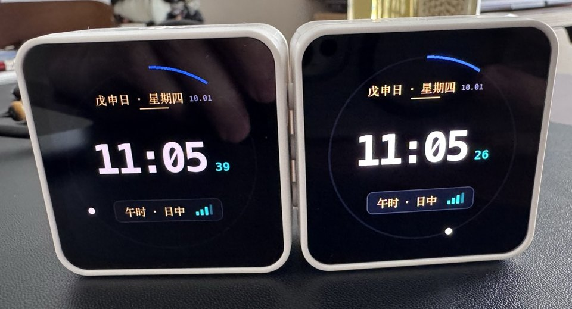
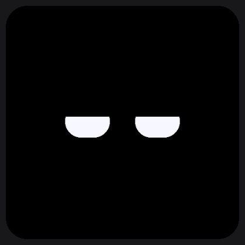
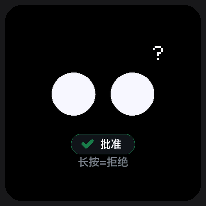
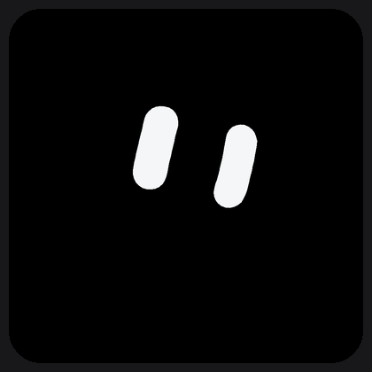
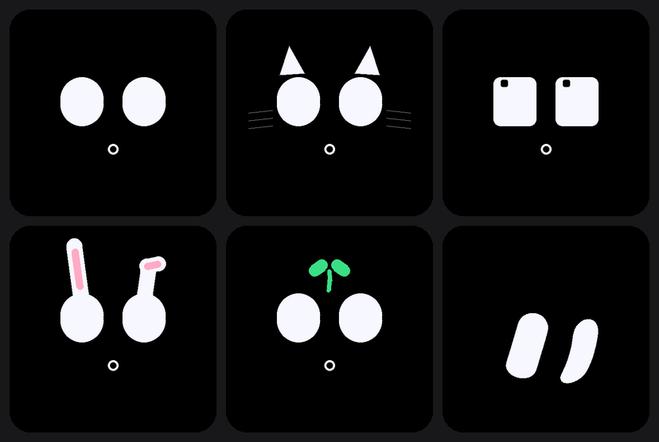
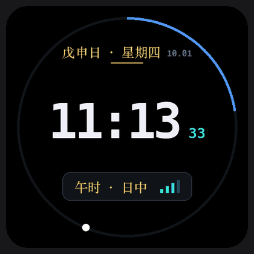
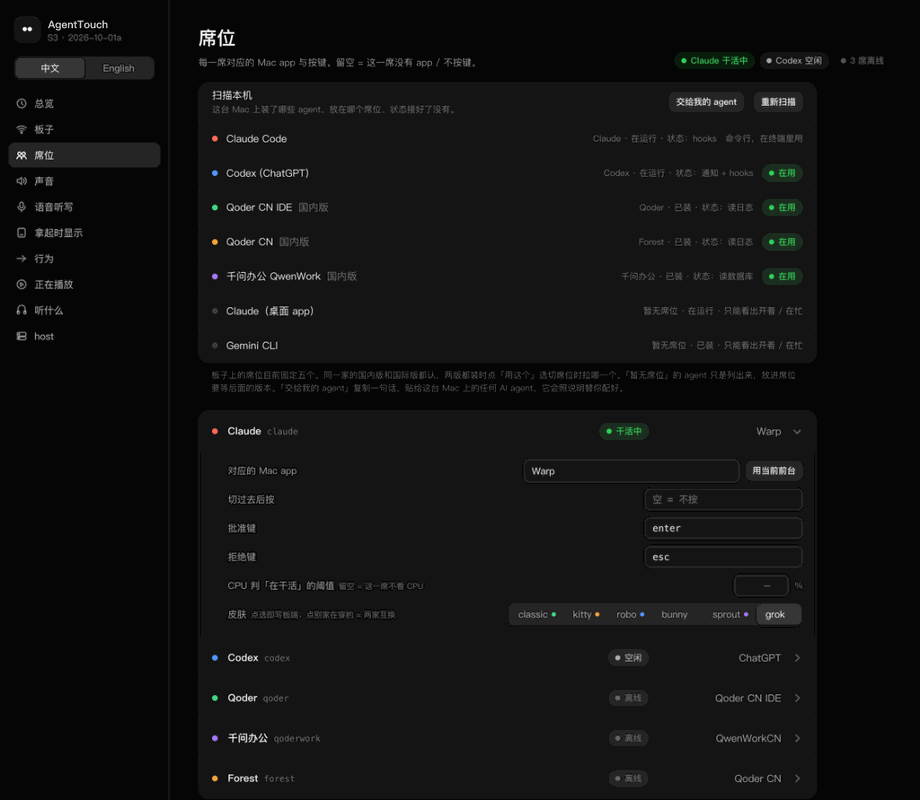
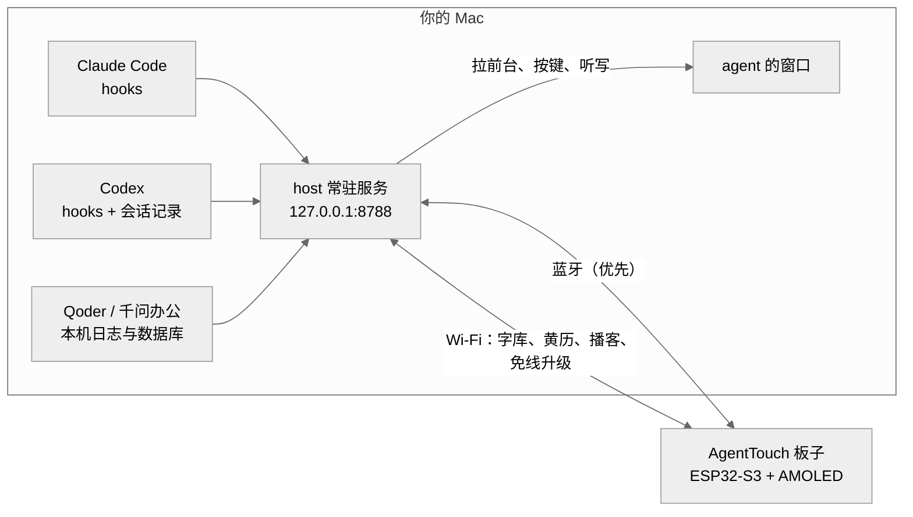

<p align="center">
  
</p>

<h1 align="center">AgentTouch</h1>

<p align="center">
  <b>放在桌上的一张小脸，属于你的 AI 编程 agent。</b><br>
  Claude Code、Codex、Qoder、千问办公在干什么，一眼就知道；点一下就是批准，按住说话就是听写。
</p>

<p align="center">
  <a href="README.md">English</a> · 简体中文
</p>

<p align="center">
  <a href="LICENSE"></a>
  
  
</p>

<p align="center">
  
  
  
</p>
<p align="center"><sub>空闲 → 干活中 → 等你批准 → 干完了 &nbsp;·&nbsp; 点一下就是批准 &nbsp;·&nbsp; grok 皮肤</sub></p>

https://github.com/user-attachments/assets/155b532f-d46f-4f69-8415-f9d9466a5a21

<p align="center"><sub>60 秒介绍。屏幕上的画面由固件自己的绘图代码画出；整机图、转场和触摸圆点是示意。</sub></p>

## 它能做什么

- **一眼看到 agent 在干嘛。** 空闲、干活中、等你批准、干完了，各有一张脸。板子有五个席位（Claude Code、Codex、Qoder IDE、千问办公、Qoder 桌面版），左右滑切换，Mac 会把那家的窗口拉到前台。
- **点一下就是批准。** agent 要你确认时，板子跳回它的脸并浮出「✓ 批准」。点一下批准，长按拒绝，Mac 那边替你按键。
- **按住说话。** 按住右键说话，字落进 agent 的输入框；点一下屏幕就是回车发送。
- **六套皮肤，一席一宠。** classic、kitty、robo、bunny、sprout、grok，切 agent 就是换角色。
- **侧着放，就是钟表和黄历。** 圆环钟表、Mac 正在播放、板上播客、日历、赛博黄历；扣在桌上就睡觉。
- **有点像宠物。** 摸头、摇晃、插电吃饭；连续干活 90 分钟，它会喊你休息。

<p align="center">
  
  
</p>

<p align="center">
  
  
  
</p>
<p align="center"><sub>插电：吃饭 &nbsp;·&nbsp; 充满：打嗝 &nbsp;·&nbsp; 连续干活 90 分钟：喊你休息</sub></p>

## Mac 上的设置页

板子上不做设置。所有设置都在本机网页 <http://127.0.0.1:8788/settings>（中文 / English），点选即生效：席位与皮肤、板子的 Wi-Fi、声音、听写、正在播放、播客，以及 host 的运行状况。

<p align="center">
  
</p>
<p align="center"><sub>截图里的 Mac 名、Wi-Fi 名、IP 和歌名都是示例值。</sub></p>

## 原理



- **一切都在你的 Mac 上。** 状态来自各家 agent 自己的 hooks 或本机文件，不上传你的代码和对话。
- **板子是纯客户端。** 只有蓝牙也能用；Wi-Fi 用来推字库、播客、语音播报和免线升级。
- **一块板只跟一台 Mac。** 认主要在板子上点一下确认。

## 快速开始

需要：微雪 [ESP32-S3-Touch-AMOLED-2.16](https://docs.waveshare.net/ESP32-S3-Touch-AMOLED-2.16) 板子、一张 FAT32 的 microSD 卡、一根能传数据的 USB-C 线，以及一台装了 Xcode 命令行工具和 [PlatformIO](https://platformio.org/) 的 Mac。

```bash
git clone https://github.com/wentong2022-arch/agenttouch.git && cd agenttouch
host/setup.sh                                  # 装 Mac 端；问到 Pillow 时请装
cd firmware && pio run -e amoled216 -t upload  # 插上 USB 线，第一次烧固件
```

然后在板上点「连接」，在设置页给板子配 Wi-Fi。每一步的细节见[安装指南](doc/02-install.zh-CN.md)。

**也可以让你的编程 agent 来装。** 把这句话发给 Claude Code、Codex 或别的编程 agent：

> 请按 https://github.com/wentong2022-arch/agenttouch/blob/main/host/agent_install.md 帮我在这台 Mac 上安装 AgentTouch。需要我动手或输密码的地方，停下来告诉我。

它不会替你输密码，也不会改系统权限，遇到这些会停下来问你。

## 文档

| 文档 | 内容 |
|---|---|
| [硬件](doc/01-hardware.zh-CN.md) | 规格、引脚、按键、外壳四边与传感器轴向 |
| [安装](doc/02-install.zh-CN.md) | 分步安装、更新固件、恢复出厂 |
| [使用](doc/03-usage.zh-CN.md) | 手势、按键、各个页面、设置页 |
| [排错](doc/04-troubleshooting.zh-CN.md) | 常见问题与解决办法 |
| [架构](doc/05-architecture.zh-CN.md) | host 和板子怎么通信、代码地图、状态检测 |
| [屏幕规则](doc/06-screen-rules.zh-CN.md) | 屏幕在什么时候显示哪一页 |
| [给 agent 的安装说明](host/agent_install.md) | 你的编程 agent 照着做的那一页（英文） |

## 反馈

欢迎提 [issue](https://github.com/wentong2022-arch/agenttouch/issues)：bug、想法、在你的板子或 Mac 上遇到的问题都行。暂时不接受 PR。

## 许可证

AgentTouch 作者：yuwentong。

- **代码**：[PolyForm Noncommercial 1.0.0](LICENSE)。个人、学习、研究等非商业用途免费使用；**商业用途需要书面授权**，请联系 wentong2022@gmail.com。
- **文档与黄历词库**：[CC BY-NC-SA 4.0](LICENSE-CC-BY-NC-SA-4.0.txt)。
- **名称与形象**：宠物的表情形象予以保留。基于本项目做的东西请换个名字，别让人以为是原版。
- **仓库里不带任何字体数据。** 字形由你自己的 Mac 用系统字体生成。

**致谢**（许可证原文在 [`THIRD_PARTY_LICENSES/`](THIRD_PARTY_LICENSES)）：
grok 皮肤的眼形数据来自 [nasawz/GrokBot](https://github.com/nasawz/GrokBot)（BSD-3-Clause）；
音频芯片 ES8311 / ES7210 的初始化序列源自 [espressif/esp-bsp](https://github.com/espressif/esp-bsp)（Apache-2.0）；
提示音的情绪音调取自 [OttoDIY/OttoDIYLib](https://github.com/OttoDIY/OttoDIYLib) 的 `sing()`；
介绍视频的配乐是原创的，乐器音色来自 S. Christian Collins 的 [GeneralUser GS](https://www.schristiancollins.com/generaluser)。
