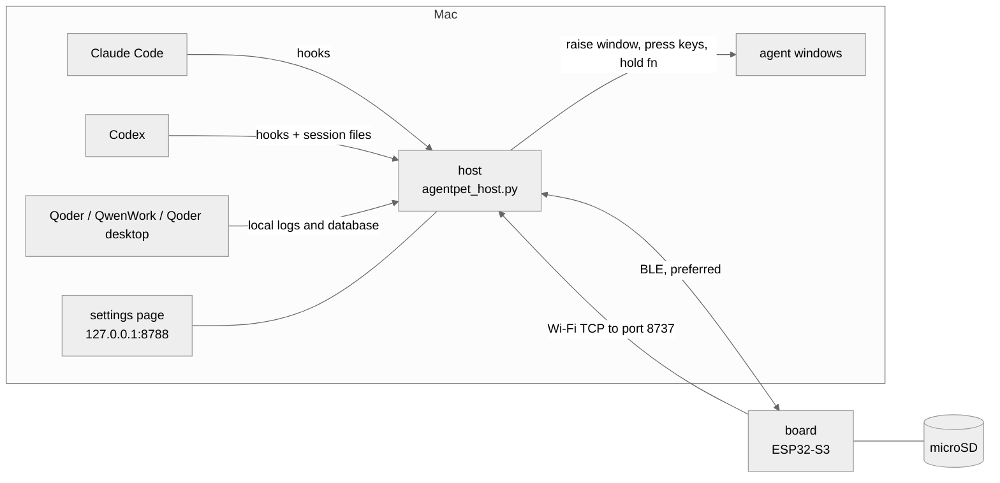

# Architecture

English · [简体中文](05-architecture.zh-CN.md)

How the board, the Mac host and your agents fit together: the links, the wire protocol, the microSD card, the code map and how each agent's state is worked out.

## Overview



The board is a pure client. It draws what the host tells it and reports taps, swipes and key presses back. The host is one Python process on the Mac: it works out each agent's state from hooks and local files, pushes it to the board, and acts on the Mac for the board (raises the agent's window, presses the approve key, holds fn for dictation). State detection runs entirely on the Mac.

## Components

| Part | What it is |
|---|---|
| Firmware (`firmware/`) | Arduino on the ESP32-S3, built with PlatformIO (env `amoled216`). Faces, pages, touch, keys, IMU, sound, links. |
| Host (`host/agentpet_host.py`) | One process, run by `/usr/bin/python3`. Agent states, BLE and TCP links, HTTP on port 8788. |
| `AgentPetHost.app` | A small C wrapper (`host/agentpet_wrap.c`) in `~/Applications` that starts the host. macOS grants Bluetooth and Accessibility to this app; the Python child inherits them. |
| LaunchAgent `com.agentpet.host` | Starts the wrapper at login, restarts it if it exits. It runs the copies in `~/.agentpet/`, because launchd cannot read `~/Documents`. |
| `pet` | `pet status \| on \| off \| restart \| log \| claim`. |
| Settings page | `http://127.0.0.1:8788/settings`, in 中文 / English. Seats, board Wi-Fi, owner Mac, sound, dictation and the rest. |

On the Mac the host raises apps with `open -a`, presses keys with Quartz events (this needs Accessibility), and starts dictation by holding fn, so it relies on an input method that dictates while fn is held.

## Links and ports

| Link | Who connects | Carries |
|---|---|---|
| BLE, Nordic UART service | the host connects to the board, which advertises `AgentPet` | states, events, approvals, dictation audio, Wi-Fi setup, owner claims |
| Wi-Fi TCP | the board connects to the Mac on port 8737 | the same messages, plus file pushes, firmware, speech clips, screenshots |
| USB serial | a cable | the same JSON lines; used by `host/shot.py`, `host/sdpush_usb.py` and for debugging |

- The Mac opens two ports. **8788** is bound to 127.0.0.1: hooks, the settings page, `/state`, `/ota` and the `/test/*` debug endpoints. It is needed whether or not a board is around. **8737** listens on the LAN for the board. The board opens no ports.
- The board sends events over BLE when it is up, else over TCP, and a `ping` every 10 s on each link; a link that goes quiet is dropped. BLE alone is enough for states, approvals and dictation; files, firmware, speech and screenshots need TCP.
- The board finds the owner Mac over TCP by its mDNS name, else by the last IP the host told it.
- Wi-Fi networks come from the settings page over BLE. The board keeps up to 4 in NVS and joins the strongest one in range. After 3 minutes without a known network it turns the radio off and probes now and then; BLE keeps working.
- Before the Mac sleeps the host drops both links, and takes them back once the display is on, so the board's heartbeat cannot keep waking the Mac.

### One owner Mac

The board follows one owner Mac, stored in NVS and advertised as a digest. Only the owner's link carries app traffic; another Mac's host stands by. The first time a Mac connects, and whenever another Mac claims the board (`pet claim` or the settings page), the board shows a claim card, and only a tap on 连接 (Connect) counts. The card waits 30 s; a Mac that was declined does not ask again on its own for 10 minutes.

## Protocol

Every link carries the same protocol: one JSON object per line, ending in `\n`, with the message type in `t`. Unknown types are ignored.

```json
{"t":"state","agents":{"claude":"working","codex":"needs_you","qoder":"off","qoderwork":"off","forest":"idle"}}
{"t":"voice","a":"start","agent":"claude","mic":false,"link":"ble"}
{"t":"key","k":"approve"}
```

Host to board:

| `t` | Meaning |
|---|---|
| `state` | One status per seat. Sent when a link comes up and on every change. |
| `cfg`, `time`, `almanac` | Preferences (`voice`, `mic`, `mic_link`, `show_off`, `lang`, `pickup`); clock; today's almanac. |
| `hostinfo`, `claim` | Who this Mac is; `claim` asks the board to switch owner. |
| `select` | The Mac's front app changed; the board moves to that seat. |
| `wifi` | Add, list, remove or scan networks (`op`). |
| `sound`, `speak` + `pcm` | Built-in sound or volume; a speech clip (TCP only). |
| `skin`, `stretch` | Dress a seat in a skin; the take-a-break reminder. |
| `np`, `pl` | What the Mac is playing; the podcast list on the card changed. |
| `fbeg` `fdat` `fend`, `fls`, `fcat`, `frm` | Write a file to the card (size and CRC32 checked), list, read, delete. TCP or USB. |
| `ota` | Flash a firmware file from the card, or roll back. |
| `shot`, `sd?`, `rtc?` | Ask for a screenshot (TCP or USB); ask about the card and the hardware clock. |
| `sess` | The Claude seat's sessions (`cur` and a `list` of `id`, `ti` title, `dir` folder, `st`); an empty list below two sessions. |
| `toast` | A one-line pill; `k:"mac_approve"` = "approve on the Mac". |

Board to host:

| `t` | Meaning |
|---|---|
| `hello` | First line on a link: build and app slot, selected seat, card size, owner, skins, uptime, reset reason. `"link":"ble"` on BLE. The host answers with `time`, `almanac`, `cfg` and now-playing. |
| `ping` | Heartbeat every 10 s with uptime and heap figures; the host answers `pong`. |
| `select` | The user switched seats. `src:"host"` echoes a host `select`; `src:"auto"` means the board left a seat that went off. |
| `voice` | Right key down or up (`a`), with the seat, `to:"front"` when not on the face page, and whether board-mic audio follows. |
| `mic`, `micstat` | Board-mic audio (IMA ADPCM, 40 ms per line) and end-of-session stats. |
| `key` | `k:"approve"` or `"reject"` from the approve bubble; `k:"enter"` from the send bubble. With several Claude sessions `key` and `voice` carry `sid`, the session shown. |
| `sess_sel` | The user tapped a half of the session row: the `id` now shown. |
| `media`, `np_miss` | Play-page buttons for the Mac's player; a cover missing from the card. |
| `qian` | The almanac was tapped: read the fortune aloud. |
| `skins`, `owner`, `released` | Who wears which skin; `owner` answers `hostinfo` / `claim`; `released` tells the previous owner it was replaced. |
| `wifi`, `sd`, `rtc`, `ota`, `fack` | Replies: networks, card, clock, flash result, file-push acks. |
| `sbeg` `sdat` `sfin` | Screenshot stream. |

The full set is in `handleLine()` (`firmware/src/main.cpp`) and `handle_board_msg()` (`host/agentpet_host.py`).

## The microSD card

The card must be FAT32. The host writes to it over Wi-Fi only (or over USB with `host/sdpush_usb.py`).

| Path | What |
|---|---|
| `/agentpet/fonts/*.afn` | Full Chinese fonts (`head26`, `body26`, `quot24`, `tiny18`), baked by the host from macOS system fonts. Any glyph missing from the firmware's built-in table is read from here. |
| `/agentpet/almanac/<year>.jsonl` | The whole year of almanac days, one per line, so the page works without the host. |
| `/agentpet/audio/` | Podcast episodes: `<name>.ima` (16 kHz IMA ADPCM) plus `<name>.json` (title, show, length); `state.json` remembers where playback stopped. |
| `/agentpet/covers/` | Album covers for the now-playing page (baseline JPEG, up to 200×200). |
| `/agentpet/fw/new.bin` | Firmware waiting to be flashed. |

When the board connects over Wi-Fi with a card in, the host pushes whatever is missing: fonts, the year's almanac, queued files and podcasts.

### Cable-free updates

```bash
cd firmware && pio run -e amoled216 && cp .pio/build/amoled216/firmware.bin ~/.agentpet/fw.bin
curl -s http://127.0.0.1:8788/ota              # about 50 s end to end
curl -s "http://127.0.0.1:8788/ota?rollback=1"  # back to the previous firmware
```

The host pushes `fw.bin` to `/agentpet/fw/new.bin`. The board checks size and CRC32, writes the other app slot, boots from it and says `hello` again; `/state` shows the new build and slot under `fw`. Rollback just boots the other slot. The first flash, and recovery, use USB (`pio run -e amoled216 -t upload`).

## Code map

```
firmware/
  platformio.ini        build env amoled216, pinned library versions
  gen_font_table.py     pre-build step: bakes src/almanac_font.h if it is missing
  src/main.cpp          loop, links, owner claim, Wi-Fi, keys, touch, IMU, pages, messages, OTA
  src/config.h          seat table, touch mapping, page per orientation, defaults; includes an optional config.local.h
  src/pins.h            pin map
  src/ble.cpp/.h        NimBLE Nordic UART server, owner link plus one visitor
  src/face.cpp/.h       face renderer: skins, bubbles, cards
  src/grokface.cpp/.h   the grok skin: polygon eyes, spring morph
  src/grok_eyes.h       grok eye shapes, from GrokBot (BSD-3-Clause)
  src/pages.cpp/.h      clock, almanac, calendar and play pages; anti-aliased CJK text
  src/i18n.h            English strings for the board
  src/audio.cpp/.h      ES8311 speaker, ES7210 mics, synthesized sounds, speech clips
  src/player.cpp/.h     podcast player for the .ima files on the card
  src/sdcard.cpp/.h     microSD mount (native 1-bit, SPI fallback), hot-plug
  src/sdfont.cpp/.h     card fonts as the fallback for missing glyphs
  src/jpegrom.cpp/.h    cover JPEGs, decoded by the ESP32-S3 ROM decoder
  src/boardrtc.cpp/.h   PCF85063 clock: seeds the time at boot, takes the host's time
  src/pet_fonts.h       U8g2 fonts for faces and pages
  src/almanac_font.h    generated glyph table, not in git
host/
  agentpet_host.py      the host: states, BLE (bleak) and TCP links, HTTP, settings page, pushes
  agentpet_wrap.c       source of AgentPetHost.app: runs /usr/bin/python3 ~/.agentpet/agentpet_host.py
  setup.sh              install or repair, safe to re-run; --check only reports
  pet                   the host's on/off switch
  install_hooks.py      adds or removes (--remove) the Claude Code hooks
  codex_notify.sh       Codex notify -> /hook/codex/notify
  codex_permission_hook.sh   Codex PermissionRequest hook -> /hook/codex/permission
  gen_almanac_font.py   bakes the firmware glyph table and the card fonts from system fonts
  almanac_bank.json     almanac word bank
  mic_sink.swift        plays board-mic audio into BlackHole, so the input method hears it
  shot.py, sdpush_usb.py     screenshot and file push over USB
  test_host.py          host unit tests
  agent_install.md      install guide for an AI coding agent
  agent_setup.md        seat setup guide, served at /agent-setup
```

## State detection

| Status | Meaning |
|---|---|
| `off` | The app is not running. |
| `idle` | Running, nothing happening. |
| `working` | The agent is busy. |
| `needs_you` | Waiting for your approval or answer. The only state that may take over the screen (see [Screen rules](06-screen-rules.md)). |
| `done` | Just finished; shown for 90 s, then `idle`. |

### Claude Code

Hooks in `~/.claude/settings.json` POST each event to `http://127.0.0.1:8788/hook/claude/<Event>?src=agentpet`. They use `curl -m 2 … || true`, so a missing host never blocks Claude Code.

| Hook | Effect |
|---|---|
| `UserPromptSubmit`, `PreToolUse`, `PostToolUse` | `working`; back to `idle` after 15 min without hooks (a safety net: `Stop`, a detected interrupt or the idle reminder end a turn first), and not while a Bash-tool command of that session is still running |
| `Notification` | `needs_you`, except the "waiting for your input" idle reminder, which never raises it |
| `Stop` | `done` |
| `SessionStart` / `SessionEnd` | session added as `idle` / removed |

- An interrupted turn sends no `Stop`. The host spots the interrupt marker in the session transcript and goes back to `idle`.
- With several sessions the strongest wins: `needs_you` > `working` > `done` > `idle`. No session but a `claude` process means `idle`; neither means `off`.

**Several sessions.** The hook command also sends headers: the claude PID (`$PPID` of the hook shell), its tty, `TERM_PROGRAM`, the terminal's bundle id, `WARP_FOCUS_URL` and `ITERM_SESSION_ID`. A session without them (started before the hooks changed) is matched to the one `claude` process in its folder, and its environment read with `ps eww`. Only sessions with a tty are listed; one whose process exits leaves at once; the list is saved to `~/.agentpet/claude_sessions.json` so a host restart keeps it. Each session's title is the latest `ai-title` line of its transcript.

To bring a session's tab forward the host uses `open <WARP_FOCUS_URL>` in Warp, AppleScript by tty in Terminal (read back and retried once), by session id in iTerm2, by working directory and title in Ghostty, and `open -b <bundle>` anywhere else. The Warp variables are trusted only when `TERM_PROGRAM` says Warp: anything started from a Warp shell inherits them. Approve, reject, the send bubble's Return, face-page dictation and a board seat switch all land in the session the board shows; an approve for a session that is no longer waiting is dropped. `curl -s http://127.0.0.1:8788/test/sess/list` shows the table.

### Codex

- **working**: a `codex` process is running (the ChatGPT app embeds one) and `~/.codex/sessions` was written in the last 60 s, or the process is busy on CPU.
- **done**: Codex's `notify` command in `~/.codex/config.toml` runs `~/.agentpet/codex_notify.sh`, which forwards `agent-turn-complete`. Side threads the desktop app starts, such as titling a task, have no session file and are ignored.
- **needs_you** has two sources. The `PermissionRequest` hook in `~/.codex/hooks.json` covers escalated shell commands. Code-mode permission cards fire no hook, so the host also reads recent session files: an unanswered `request_permissions` call, quiet for 2 s, counts. Either clears when the session moves on, at turn end, or after 10 minutes.

`~/.codex/hooks.json` (`host/setup.sh` writes it, keeping any hooks already there):

```json
{"hooks": {"PermissionRequest": [{"hooks": [{"type": "command",
  "command": "/Users/<you>/.agentpet/codex_permission_hook.sh",
  "timeout": 5, "statusMessage": "AgentTouch needs_you"}]}]}}
```

### Other seats

For Qoder IDE, QwenWork and the Qoder desktop app, the process list says whether the app is running, and the state is read from the logs and database those apps keep on this Mac.

## Configuration

`~/.agentpet/config.json` overrides the defaults at the top of `host/agentpet_host.py`. The settings page writes this file and applies changes at once; hand edits apply at the next `pet restart`.

| Key | What |
|---|---|
| `focus_apps` | App to raise for each seat (defaults in `FOCUS_APPS`) |
| `focus_keys` | Key to press after raising, to focus the input box |
| `approve_keys`, `reject_keys` | Per seat; default `enter` / `esc` |
| `focus_follow`, `follow_front`, `focus_settle_s` | Board seat switch raises the app; board follows the Mac's front app; wait after the last swipe (1.5 s) |
| `voice_source`, `mic_link` | `mac` or `board` mic for dictation; board-mic link `ble`, `tcp` or `auto` |
| `voice_style` | `chirp`, or `tts` to speak needs-you and done |
| `pickup_page` | Page when picked up: `follow`, `face`, `clock`, `almanac` |
| `show_off_seats` | Show all five seats, even apps that are not running |
| `lang`, `now_playing` | `zh` or `en`; the now-playing page on or off |
| `stretch_after_min` | Break reminder after this many minutes of work (90; 0 = off) |
| `proc_rules`, `cpu_working` | Process match rules and CPU thresholds for detection |

The Claude Code hooks are tagged `?src=agentpet`. `/usr/bin/python3 host/install_hooks.py --remove` removes only those, after backing up `settings.json`.

## Development

```bash
/usr/bin/python3 host/test_host.py -v            # host unit tests: stdlib only, no board, no network
cd firmware && pio run -e amoled216               # build; add -t upload to flash over USB
cp host/agentpet_host.py host/almanac_bank.json ~/.agentpet/ && pet restart   # run your host changes
curl -s http://127.0.0.1:8788/state               # host, links, card, firmware
```

Rules for contributors:

- Run the host only with `/usr/bin/python3`. `setup.sh` installs the packages there and the firewall is set to let it in; another Python is blocked and the board cannot connect.
- Run `host/test_host.py` after every host change.
- On the board, bytes reach the TCP socket only through `tcpWriteLine()` / `tcpWriteLines()`: one door that frames every line, never leaves one half-written and never blocks the loop. No raw `sock.print`, `sock.write` or `send()`. A batch must end in `\n`; take lengths from `strlen` / `sizeof`, never count by hand. On the host the same job belongs to `tcp_send()`.
- After touching a TCP or BLE send path, check that `/test/badlines` does not grow across a screenshot (`/test/shot?s=1`) and a dictation session.
- Compare times as `(int32_t)(millis() - ts) > N`, which survives wrap-around.
- Add new seats at the end of `AGENTS`, in the host and in `config.h`: some messages carry per-seat arrays by index.
- `firmware/src/config.local.h` and `firmware/platformio.local.ini` are local overrides, not in git. After editing `config.local.h`, `touch firmware/src/config.h`, or it will not rebuild.
