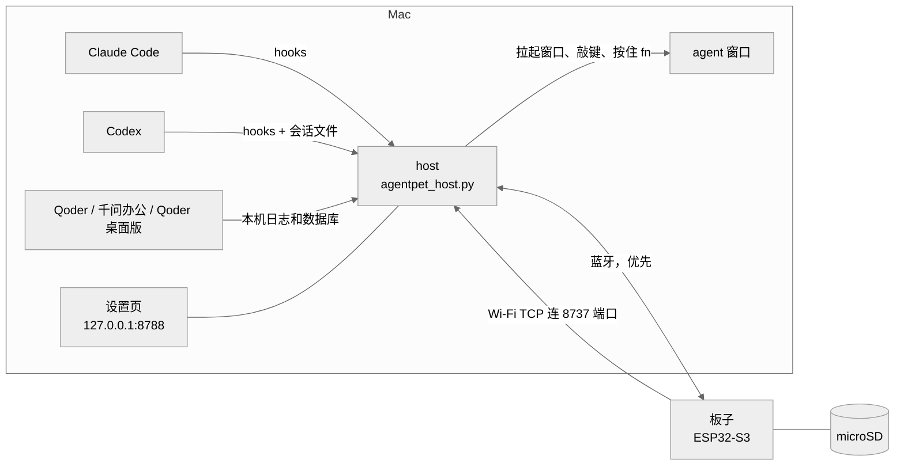

# 架构

[English](05-architecture.md) · 简体中文

板子、Mac 上的 host 和你的 agent 怎么连在一起：链路、通信协议、microSD 卡、代码地图，以及每家 agent 的状态是怎么判断出来的。

## 总览



板子是纯客户端：host 让它画什么它就画什么，再把点按、滑动和按键报回去。host 是 Mac 上的一个 Python 进程：它从 hooks 和本机文件判断每家 agent 的状态，推给板子，并替板子在 Mac 上动手（拉起 agent 窗口、敲批准键、按住 fn 听写）。状态检测全部在 Mac 本机完成。

## 组成

| 部分 | 是什么 |
|---|---|
| 固件（`firmware/`） | ESP32-S3 上的 Arduino 程序，用 PlatformIO 编译（环境 `amoled216`）。表情、页面、触摸、按键、IMU、声音、链路。 |
| host（`host/agentpet_host.py`） | 一个进程，由 `/usr/bin/python3` 运行。agent 状态、蓝牙和 TCP 链路、8788 端口上的 HTTP。 |
| `AgentPetHost.app` | 放在 `~/Applications` 的 C 小外壳（`host/agentpet_wrap.c`），由它启动 host。macOS 把蓝牙和辅助功能权限授给这个 app，Python 子进程继承。 |
| LaunchAgent `com.agentpet.host` | 登录时启动外壳，退出后自动拉起。它跑的是 `~/.agentpet/` 里的副本，因为 launchd 读不了 `~/Documents`。 |
| `pet` | `pet status \| on \| off \| restart \| log \| claim`。 |
| 设置页 | `http://127.0.0.1:8788/settings`，中文 / English 两档。席位、板子 Wi-Fi、主人 Mac、声音、听写等。 |

在 Mac 上，host 用 `open -a` 拉起 app，用 Quartz 事件敲键（需要辅助功能权限），按住 fn 启动听写，所以要配一个「按住 fn 说话」的输入法。

## 链路与端口

| 链路 | 谁发起连接 | 传什么 |
|---|---|---|
| 蓝牙 BLE，Nordic UART 服务 | host 连板子，板子广播名 `AgentPet` | 状态、事件、批准、听写音频、Wi-Fi 配置、认领 |
| Wi-Fi TCP | 板子连 Mac 的 8737 端口 | 同样的消息，外加推文件、固件、语音片段、截图 |
| USB 串口 | 一根线 | 同样的 JSON 行；`host/shot.py`、`host/sdpush_usb.py` 和调试用 |

- Mac 开两个端口。**8788** 只绑 127.0.0.1：hooks、设置页、`/state`、`/ota` 和 `/test/*` 调试接口，不管板子在不在都要开着。**8737** 在局域网上等板子连进来。板子自己不开端口。
- 板子发事件时蓝牙在就走蓝牙，否则走 TCP；每条链路上每 10 s 发一次 `ping`，安静太久的链路会被断开。只有蓝牙也够用：状态、批准、听写都能走；推文件、固件、语音和截图要 TCP。
- 板子走 TCP 时按主人 Mac 的 mDNS 名找它，找不到就用 host 上次告诉它的 IP。
- Wi-Fi 由设置页经蓝牙推给板子。板子在 NVS 里最多记 4 个，连范围内信号最强的。3 分钟找不到已知网络就关掉 Wi-Fi 射频、隔一阵探测一次，蓝牙照常。
- Mac 睡眠前 host 断开两条链路，屏幕亮起后再接回，免得板子的心跳把 Mac 一次次叫醒。

### 一块板子跟一台 Mac

板子只跟一台主人 Mac，记在 NVS 里，广播里带它的摘要。只有主人的链路传业务消息，别的 Mac 上的 host 待机不抢。第一次有 Mac 连上，以及另一台 Mac 要认领时（`pet claim` 或设置页），板子会弹出认领卡，只有在板上点「连接」才算数。卡片等 30 s；被拒绝的 Mac 10 分钟内不会自己再问。

## 协议

所有链路用同一套协议：一行一个 JSON 对象，以 `\n` 结尾，消息类型放在 `t` 字段。不认识的类型直接忽略。

```json
{"t":"state","agents":{"claude":"working","codex":"needs_you","qoder":"off","qoderwork":"off","forest":"idle"}}
{"t":"voice","a":"start","agent":"claude","mic":false,"link":"ble"}
{"t":"key","k":"approve"}
```

host → 板子：

| `t` | 含义 |
|---|---|
| `state` | 每个席位一个状态。链路接通时和每次变化时发。 |
| `cfg`、`time`、`almanac` | 偏好（`voice`、`mic`、`mic_link`、`show_off`、`lang`、`pickup`）；时钟；今日黄历。 |
| `hostinfo`、`claim` | 这台 Mac 是谁；`claim` 请板子换主人。 |
| `select` | Mac 前台 app 变了，板子切到对应席位。 |
| `wifi` | 增、列、删、扫描 Wi-Fi（`op`）。 |
| `sound`、`speak` + `pcm` | 内置提示音或音量；一段语音（只走 TCP）。 |
| `skin`、`stretch` | 给席位换皮肤；该休息了的提醒。 |
| `np`、`pl` | Mac 正在播放什么；卡上播客列表变了。 |
| `fbeg` `fdat` `fend`、`fls`、`fcat`、`frm` | 往卡上写文件（校验大小和 CRC32）、列目录、读、删。走 TCP 或 USB。 |
| `ota` | 用卡上的固件文件刷机，或回滚。 |
| `shot`、`sd?`、`rtc?` | 要一张截图（TCP 或 USB）；问卡和硬件时钟的情况。 |

板子 → host：

| `t` | 含义 |
|---|---|
| `hello` | 链路上的第一行：固件版本和 app 槽位、当前席位、卡容量、主人、皮肤、运行时长、上次重启原因。走蓝牙时带 `"link":"ble"`。host 回 `time`、`almanac`、`cfg` 和正在播放。 |
| `ping` | 每 10 s 一次心跳，带运行时长和内存数字；host 回 `pong`。 |
| `select` | 用户切了席位。`src:"host"` 是回显 host 的 `select`；`src:"auto"` 表示板子离开了一个刚变 off 的席位。 |
| `voice` | 右键按下或松开（`a`），带席位；不在脸页时带 `to:"front"`；以及后面是否跟着板麦音频。 |
| `mic`、`micstat` | 板麦音频（IMA ADPCM，每行 40 ms）和会话结束时的统计。 |
| `key` | 批准气泡发 `k:"approve"` 或 `"reject"`；发送气泡发 `k:"enter"`。 |
| `media`、`np_miss` | 播放页上控制 Mac 播放器的按键；卡上缺的封面。 |
| `qian` | 黄历页被点了：念今日签文。 |
| `skins`、`owner`、`released` | 谁穿哪套皮肤；`owner` 答复 `hostinfo` / `claim`；`released` 告诉原主人它被换掉了。 |
| `wifi`、`sd`、`rtc`、`ota`、`fack` | 答复：网络、卡、时钟、刷机结果、推文件回执。 |
| `sbeg` `sdat` `sfin` | 截图数据流。 |

完整清单见 `handleLine()`（`firmware/src/main.cpp`）和 `handle_board_msg()`（`host/agentpet_host.py`）。

## microSD 卡

卡必须是 FAT32。host 只经 Wi-Fi 往卡上写（或用 `host/sdpush_usb.py` 走 USB）。

| 路径 | 内容 |
|---|---|
| `/agentpet/fonts/*.afn` | 全量中文字库（`head26`、`body26`、`quot24`、`tiny18`），host 用 macOS 系统字体生成。固件内置字表里没有的字都从这里读。 |
| `/agentpet/almanac/<year>.jsonl` | 一整年的黄历，一天一行，没有 host 黄历页也能用。 |
| `/agentpet/audio/` | 播客：`<name>.ima`（16 kHz IMA ADPCM）加 `<name>.json`（标题、节目、时长）；`state.json` 记着播到哪儿。 |
| `/agentpet/covers/` | 正在播放页的封面（baseline JPEG，最大 200×200）。 |
| `/agentpet/fw/new.bin` | 等着刷进去的固件。 |

板子经 Wi-Fi 连上且插着卡时，host 会把缺的东西补推上去：字库、当年黄历、排队的文件和播客。

### 免线升级

```bash
cd firmware && pio run -e amoled216 && cp .pio/build/amoled216/firmware.bin ~/.agentpet/fw.bin
curl -s http://127.0.0.1:8788/ota              # 全程约 50 s
curl -s "http://127.0.0.1:8788/ota?rollback=1"  # 切回上一版固件
```

host 把 `fw.bin` 推到 `/agentpet/fw/new.bin`。板子校验大小和 CRC32，写进另一个 app 槽，从它启动，再发一次 `hello`；`/state` 的 `fw` 里能看到新的版本和槽位。回滚就是改从另一个槽启动。第一次刷机和救砖用 USB（`pio run -e amoled216 -t upload`）。

## 代码地图

```
firmware/
  platformio.ini        编译环境 amoled216，库版本锁定
  gen_font_table.py     编译前一步：src/almanac_font.h 不存在就生成
  src/main.cpp          主循环、链路、认领、Wi-Fi、按键、触摸、IMU、页面、消息、OTA
  src/config.h          席位表、触摸映射、各朝向对应的页面、默认值；会引入可选的 config.local.h
  src/pins.h            引脚表
  src/ble.cpp/.h        NimBLE 的 Nordic UART 服务端，主人链路外加一个访客
  src/face.cpp/.h       表情渲染：皮肤、气泡、卡片
  src/grokface.cpp/.h   grok 皮肤：多边形眼睛、弹簧变形
  src/grok_eyes.h       grok 眼形数据，来自 GrokBot（BSD-3-Clause）
  src/pages.cpp/.h      钟表、黄历、日历、播放页；抗锯齿中文
  src/i18n.h            板上界面的英文字符串
  src/audio.cpp/.h      ES8311 喇叭、ES7210 麦克风、合成提示音、语音片段
  src/player.cpp/.h     播放卡上 .ima 文件的播客播放器
  src/sdcard.cpp/.h     microSD 挂载（原生 1-bit，SPI 兜底）、热插拔
  src/sdfont.cpp/.h     卡上字库，给缺的字兜底
  src/jpegrom.cpp/.h    封面 JPEG，用 ESP32-S3 ROM 里的解码器
  src/boardrtc.cpp/.h   PCF85063 时钟：开机给时间、接收 host 校时
  src/pet_fonts.h       表情和页面用的 U8g2 字体
  src/almanac_font.h    生成的字表，不进 git
host/
  agentpet_host.py      host 本体：状态、蓝牙（bleak）和 TCP 链路、HTTP、设置页、推送
  agentpet_wrap.c       AgentPetHost.app 的源码：运行 /usr/bin/python3 ~/.agentpet/agentpet_host.py
  setup.sh              安装或修复，可重复跑；--check 只报告
  pet                   host 的开关
  install_hooks.py      添加或删除（--remove）Claude Code hooks
  codex_notify.sh       Codex notify -> /hook/codex/notify
  codex_permission_hook.sh   Codex PermissionRequest hook -> /hook/codex/permission
  gen_almanac_font.py   用系统字体生成固件字表和卡上字库
  almanac_bank.json     黄历词库
  mic_sink.swift        把板麦音频放进 BlackHole，让输入法听得到
  shot.py, sdpush_usb.py     走 USB 截图、推文件
  test_host.py          host 单元测试
  agent_install.md      给 AI 编程 agent 看的安装说明
  agent_setup.md        席位配置说明，在 /agent-setup 提供
```

## 状态检测

| 状态 | 含义 |
|---|---|
| `off` | app 没在运行。 |
| `idle` | 在运行，没动静。 |
| `working` | agent 在干活。 |
| `needs_you` | 等你批准或回答。唯一能抢屏的状态（见[屏幕规则](06-screen-rules.zh-CN.md)）。 |
| `done` | 刚干完；显示 90 s 后回到 `idle`。 |

### Claude Code

`~/.claude/settings.json` 里的 hooks 把每个事件 POST 到 `http://127.0.0.1:8788/hook/claude/<Event>?src=agentpet`。它们用 `curl -m 2 … || true`，host 不在也卡不住 Claude Code。

| Hook | 效果 |
|---|---|
| `UserPromptSubmit`、`PreToolUse`、`PostToolUse` | `working`；120 s 没有新 hook 回到 `idle` |
| `Notification` | `needs_you`；但「waiting for your input」这条闲置提醒永远不算 |
| `Stop` | `done` |
| `SessionStart` / `SessionEnd` | 会话以 `idle` 加入 / 移除 |

- 被打断的一轮不会发 `Stop`。host 在会话记录里看到打断标记，就回到 `idle`。
- 多个会话取最强的：`needs_you` > `working` > `done` > `idle`。没有会话但有 `claude` 进程算 `idle`，都没有算 `off`。

### Codex

- **working**：有 `codex` 进程（ChatGPT app 内嵌一个），并且 `~/.codex/sessions` 最近 60 s 有写入，或进程 CPU 在忙。
- **done**：`~/.codex/config.toml` 里的 `notify` 命令运行 `~/.agentpet/codex_notify.sh`，把 `agent-turn-complete` 转给 host。桌面 app 另开的侧线程（比如给任务起标题）没有会话文件，直接忽略。
- **needs_you** 有两个来源。`~/.codex/hooks.json` 里的 `PermissionRequest` hook 管提权的 shell 命令。代码模式的权限卡不触发任何 hook，所以 host 还会读最近的会话文件：一条没人回答、静默满 2 s 的 `request_permissions` 调用也算。两种都在会话继续写入、这一轮结束或 10 分钟后清掉。

`~/.codex/hooks.json`（`host/setup.sh` 会写好，保留已有的其他 hook）：

```json
{"hooks": {"PermissionRequest": [{"hooks": [{"type": "command",
  "command": "/Users/<you>/.agentpet/codex_permission_hook.sh",
  "timeout": 5, "statusMessage": "AgentTouch needs_you"}]}]}}
```

### 其他席位

Qoder IDE、千问办公和 Qoder 桌面版：进程列表判断 app 开没开，状态从这些 app 在本机留下的日志和数据库里读。

## 配置

`~/.agentpet/config.json` 覆盖 `host/agentpet_host.py` 顶部的默认值。设置页写的就是这个文件，保存即生效；手改要等下次 `pet restart`。

| 键 | 作用 |
|---|---|
| `focus_apps` | 每个席位拉起哪个 app（默认值见 `FOCUS_APPS`） |
| `focus_keys` | 拉起后敲的键，用来把光标放进输入框 |
| `approve_keys`、`reject_keys` | 逐席位；默认 `enter` / `esc` |
| `focus_follow`、`follow_front`、`focus_settle_s` | 板上切席位时拉起 app；板子跟随 Mac 前台 app；最后一次滑动后等多久（1.5 s） |
| `voice_source`、`mic_link` | 听写用 `mac` 还是 `board` 的麦；板麦链路 `ble`、`tcp` 或 `auto` |
| `voice_style` | `chirp`，或 `tts` 用语音播报 needs_you 和 done |
| `pickup_page` | 拿起时显示：`follow`、`face`、`clock`、`almanac` |
| `show_off_seats` | 五个席位全显示，app 没开的也显示 |
| `lang`、`now_playing` | `zh` 或 `en`；正在播放页开或关 |
| `stretch_after_min` | 连续干活多少分钟提醒休息（90；0 = 关） |
| `proc_rules`、`cpu_working` | 检测用的进程匹配规则和 CPU 阈值 |

Claude Code hooks 都带 `?src=agentpet` 标记。`/usr/bin/python3 host/install_hooks.py --remove` 只删这些，删之前先备份 `settings.json`。

## 开发

```bash
/usr/bin/python3 host/test_host.py -v            # host 单测：只用标准库，不要板子、不联网
cd firmware && pio run -e amoled216               # 编译；加 -t upload 走 USB 烧录
cp host/agentpet_host.py host/almanac_bank.json ~/.agentpet/ && pet restart   # 让改过的 host 生效
curl -s http://127.0.0.1:8788/state               # host、链路、卡、固件
```

贡献代码的规矩：

- host 只用 `/usr/bin/python3` 跑。`setup.sh` 把依赖装在它那里，防火墙也只放行它；换别的 Python 会被拦，板子连不上。
- 每次改完 host 跑一遍 `host/test_host.py`。
- 板端往 TCP 写字节只能走 `tcpWriteLine()` / `tcpWriteLines()` 这一扇门：每行都补好换行、写了一半必写完、从不卡住主循环。禁止裸 `sock.print`、`sock.write`、`send()`。批量写必须以 `\n` 结尾；长度一律用 `strlen` / `sizeof`，不手数。host 这边由 `tcp_send()` 担同样的职责。
- 改了 TCP 或蓝牙的发送路径，检查一次截图（`/test/shot?s=1`）加一次听写前后 `/test/badlines` 没有增加。
- 时间比较一律写 `(int32_t)(millis() - ts) > N`，溢出回绕也不出错。
- 新席位只能加在 `AGENTS` 末尾，host 和 `config.h` 都一样：有些消息按下标带每个席位的数组。
- `firmware/src/config.local.h` 和 `firmware/platformio.local.ini` 是本地覆盖，不进 git。改了 `config.local.h` 要先 `touch firmware/src/config.h`，否则不会重新编译。
